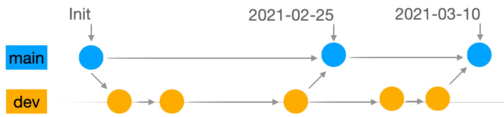
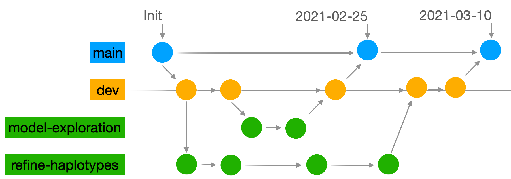
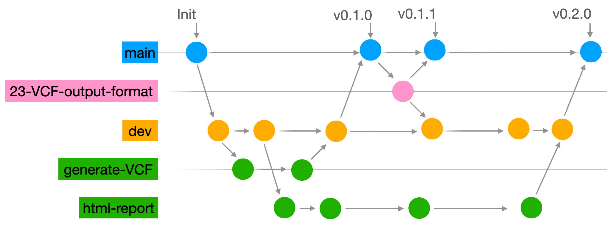

```{r setup, include=FALSE}
knitr::opts_chunk$set(echo = TRUE)
```

This document outlines principles and policies for conducting reproducible research. We strive for excellence in our research and are working toward not only making our research reproducible, but also to increase the replicability and generalizability of our findings.

To that end we currently aim to make all of our research internally auditiable. When collaborative agreements allow, we also aim to make all published research openly available and reproducible.


## 1. Auditibility

Auditable research in this context is primarily defined by internal replicability and provenance of research objects. Thus all research should have the following properties:

* All results are able to be duplcicated exactly from raw data through publication within the limits of data retention.
* Documentation is included such that results duplication should be achievable by ABCS whether the original analyst is still available or not.
* Pipeline from raw data through generation of reports is fully automated, requiring no manual steps.
* Provenance of all research objects is maintained internally. That is, chronology and origin of all research objects (data, source code, figures, tables, reports, etc...) is version controlled and available for recall.


## 2. Reproducibility

Reproducibility is an extension of auditability to the research community and includes attribution. All published research should have the following properties as far as collaborative agreements allow:

* Data are openly available under creative commons licenses or deposited in appropriate repositories and referenced in publications.
* Source code is openly available under MIT licenses (or similar) and citable.
* Source code provenance is auditable.
* Documentation is included such that all published results are exactly replicable, including but not limited to statistics, figures and tables.


## 3. Policies

### 3.1 Data provenance
*Needs work*

* for active projects
* for archived projects (DME, Cleversafe/cloudian? not sure what the current NCI standard is - ask Uma)
* for published projects (figshare or another standard archive like NCBI)
* any differences for software projects?
* data retention policies
* Role of AMP (for derivative data, not raw data - see commments in Sections 3.3 and 3.5)

### 3.2 Source code provenance
All source code will be tracked via git and follow the gitflow workflows outlined in sections 3.2.2 and 3.2.3. Git repositories will be hosted on GitHub under the [abcsFrederick](https://github.com/abcsFrederick/) organization. The only exception to this is for projects deemed sensitive, in which case code repositories will be hosted on our internal Gitea server. Use of a git GUI such as [GitKraken](https://www.gitkraken.com/) is recommended.

Analysis repositories will remain private until published. The public/private status of software repositories will be determined on a case-by-case basis until the initial release, at which point they will be publicly available. GitHub tools, such as issue tracking, discussions and GitHub actions are to be used when appropriate, especially for released software repositories.

Source code repositories are to be used only for source code. A `.gitignore` file should be included in each repository to avoid pushing any data files to GitHub, including summary output like statistics, figures and tables. The only time summary output may be included is when it has been published.

Software repositories may include small data sets, or in some exceptional cases larger data sets. Git lfs should be used in these cases. Whenever possible, larger data sets should be archived in a data repository such as [figshare](https://figshare.com/) or an [NCBI](https://www.ncbi.nlm.nih.gov/) repository, and instructions and helper tools should be included in the software package to import directly from these repositories.

All projects in AMP should link to their respective GitHub repositories in the project metadata.

#### 3.2.1 Automation
All commits on the main branch of analysis repositories should contain a single master script that will run the entire analysis from raw data input through generation of reports. This should requiring no manual steps (e.g. no copy/paste, no hand editing of figures, no formatting of tables in excel), and all outputs should be identical to those published or shared with collaborators.

GitHub actions for code building and testing automation should be utilized for all public software repositories.

#### 3.2.2 Analysis Workflow
We use a modified variation of gitflow for source code associated with analyses, with the core concept that anything shared with collaborators is on the main branch, and anything not ready to share with collaborators is on a different branch. Use of pull requests is encouraged when projects require code review. Branches should be utilized as follows:

* main: The main branch is reserved for versions shared with collaborators. Nothing should be directly committed to this branch, rather, each time results and/or reports are shared with collaborators, the relevant commit on the dev branch that is associated with the results or report should be merged into the main branch. An exception to this would be if the data are updated and no changes have been made to the source code since the previous report.
* dev: The dev branch is where all commits are pushed (for simple analysis projects). Commits should be frequent enough to contain discrete changes to code, and they should also contain complete updates. For example: data wrangling, model exploration and figures should not be included in one giant commit, and neither should a block of code that generates a single table be spread over multiple little commits.

{width=400}

* task: For more complicated analysis projects, individual branches for discrete tasks may aid organization. Only use task branches when it will be helpful. When using task branches, each task branch should have a human-readable label. Tasks may proceed serially or, as in the figure below, work may proceed simultaneously on multiple branches.

{width=467}

#### 3.2.3 Software Workflow
We use a more traditional variation of gitflow for source code associated with software projects. Similarly to the analysis workflow, anything on the main branch is deployable. Use of pull requests and code review is encouraged when merging with the main branch. Branches should be utilized as follows (see branch diagram below):

* main: The main branch is reserved for released versions of the software. Nothing should be directly committed to this branch. Releases should be merged into main using a pull request from either the dev branch, when a new version is ready for release, or from a hotfix branch for bug updates that can't wait for the next release.
* dev: The dev branch is where development occurs. Major features may be broken out and worked on in individual feature branches for more complicated software packages. When a feature is complete, it is merged into the dev branch.
* feature: A feature branch is created for each new feature, and work proceeds until it is complete and ready to merge into the dev branch. Depending on the complexity of the software package, feature branches may not be necessary. Each feature branch should be given a human-readable name.
* hotfix: A hotfix branch is created for each bug fix that needs to be addressed before the next release and should be associated with an issue in the issue tracker. The naming convention is the issue number and a human readable label. For example: "23-VCF-output-format".

{width=533}

#### 3.3.4 Documentation
Documentation styles may vary from person to person, but should minimally include the following:

* Source code is written with readability in mind, including ample white space and comments.
* README files in the root directory of each repository clearly outline the purpose of the repository, give a brief overview of the source code and explain where to obtain raw data.
* Human-readable branch names are used according to the conventions outlined above.
* Commits should be frequent enough to contain discrete changes to code, and they should also contain complete updates. For example: data wrangling, model exploration and figures should not be included in one giant commit, and neither should a block of code that generates a single table be spread over multiple little commits.
* Commit messages contain a short, descriptive header. Any additional details are shared on subsequent lines. For example:
```
Correlation figure shared on 2/25/21
Changes to the correlation figure:
* now uses a colorblind-friendly pallete
* font size increase on axes
* changed dimensions
```

### 3.3 Provenance of other research objects
Email communications with collaborators should be logged in an external thread within [AMP](https://abcs-amp.cancer.gov/). This is mostly easily accomplished in the communications tab of a project in AMP. By extension, all figures, tables and reports shared with collaborators via email should also be stored in AMP. Large files that can not be emailed should be archived and shared following the policies in Section 3.1, and a link to the data should be noted in AMP.

### 3.4 Reproducibility
As discussed in Section 3.2.1, all commits on the main branch should be fully automated. To aid with reproducibility, all relevant system information should also be given, including but not limited to operating system details and software packages and versions. The use of the [renv package](https://rstudio.github.io/renv/articles/renv.html), [Docker](https://www.docker.com/) containers or other environments can be helpful for more complicated projects. At a minimum, this information should be located near the top of the master script for the project or in the README for the repository.

### 3.5 AMP
The [Analysis Management Portal (AMP)](https://abcs-amp.cancer.gov/) is the primary source for all information regarding projects. Information stored in AMP is not only used for the purposes of Autidtibility discussed in Section 1, but also for monthly reporting. The following information and research objects should be stored in AMP:

* Link to GitHub repository - this belongs in the project metadata under GitHub. See the Project Details, and use the edit link to add/edit this information.
* Internal discussion - Internal email discussions between analysts should be logged in an internal thread. This is most easily accomplished under the Internal tab for each project. Replies to an existing email thread will also be captured.
* Collaborator communications - Email correspondence with external collaborators should be logged in an external thread. This is most easily accomplished under the Communications tab for each project. Replies to an existing email thread will also be captured.
* Document storage - Figures, tables and reports that are small enough to email should be included when shared with collaborators or when relevant to internal discussions.


## 4 Further reading
Those interested in further reading on the topic may wish to consult the following resources (no particular order):

* [Commentary on gitflow](https://ropensci.org/blog/2018/04/20/monkeydo/#gitflow)
* [Getting started with gitflow](https://www.atlassian.com/git/tutorials/comparing-workflows/gitflow-workflow)
* [Collaboration guide](https://devguide.ropensci.org/collaboration.html)
* [Reproducibility guide](https://ropensci.github.io/reproducibility-guide/sections/introduction/)
* [Good references (see theory papers)](https://github.com/leipzig/awesome-reproducible-research)
* [More good references](https://github.com/OpenScienceMOOC/Module-3-Reproducible-Research-and-Data-Analysis/blob/master/key_elements.md)
* [Happy Git with R](https://happygitwithr.com/install-intro.html) (has good installation instructions)
* The [rrtools package](https://github.com/benmarwick/rrtools) has some good tips in the README
* [Reproducible Research: A Retrospective](https://arxiv.org/pdf/2007.12210.pdf) has some good discussion on the history and the why.
* [Initial steps toward reproducible research](http://kbroman.org/steps2rr/)
* [Understanding the GitHub flow](https://guides.github.com/introduction/flow/)
